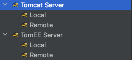
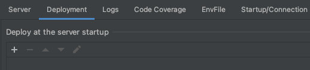
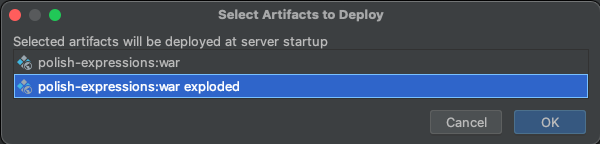
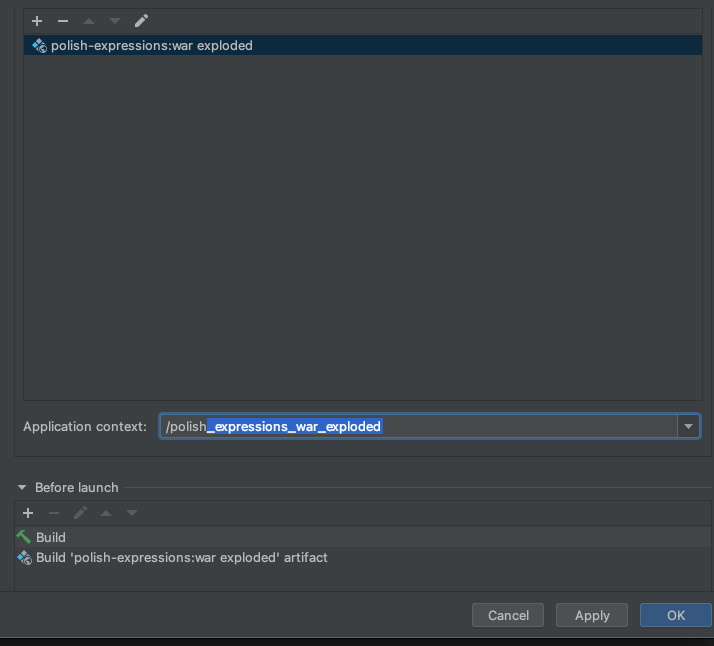

# Polish Expressions, avec Java EE

Tout d'abord, ce projet est réalisé dans le cadre d'un projet de l'EPSI, à Nantes.
Ce projet consiste à la création d'un site web, en Java, permettant d'accéder à un petit jeu de calcul
appelé les "polish expressions", en français les "notations polonaises inverses". Ce jeu doit pemrettre
l'identification d'un joueur, et d'accéder au calssement des meilleurs joueurs et aussi de ses meilleurs scores.

## Le jeu

Le jeu est simplement une liste de dix calculs, sous forme de "notations polonaises inverses", qu'il faut résoudre, 
peu importe le temps pris. À la fin, on obtient notre score sur 10, et le classement des meilleurs joueurs

## La notation polonaise inverse

Ce concept de notation polonaise inverse est un système de notation de calculs qui raccourci l'écriture, puisque l'on supprime 
les paranthèses des calculs. Par exemple (2 + 3) * 10 va s'écrire 2 3 + 10 *. Plusieurs opérateurs existent dans ce système de 
noation :
- le +, le -, le * et le / sont considérés comme des opérateurs binaires puisqu'ils utilisent deux nombres pour pouvoir effectuer
  un calcul (ex : 2 + 3).
- le inv (inverse) et le rac (racine carée) sont considérés comme des opérateurs unaires puisques n'utilisant qu'un seul nombre effectuer
  un calcul (ex : inverse de 6).
- d'autres opérateurs tel que le sinus ou encore le cosinus sont utilisables dans cette notation mais ne sont pas utilisé dans ce projet.

Cette notaion s'appuie très fortemment sur les concepts d'opérateurs bianires et unaires. Elle se lit de gauche à droite et lorsque l'on tombe 
sur un opérateur binaire, on prend les deux chiffres précédents l'opérateur, auxquels on applique justement l'opérateur (ex : 3 2 / = 3 / 2). Vous aurez donc compris 
qu'il en va de même avec les opérateurs unaires, cependant, on prend seulement le chiffre précédent l'opérateur unaire (ex : 3 inv = inverse de 3 soit 1 / 3).

## Pré-requis

- Java 17
- MySQL
- Apache Tomcat

## Pour commencer

- Installer Java et MySQL.
- Installer Intellij IDEA et Installer le plugin `Tomcat and TomEE`.

- Ouvrir un terminal et lancer MySQL.
- Accéder à la console MySQL.
- Créer une base de données :

        CREATE DATABASE <Le nom de votre base de données>;

- Sélectionner la base de données créée :

        USE <Le nom de votre base de données>;

- Créer les tables suivantes :

        create table USER_ACCOUNT
        (
        USER_NAME VARCHAR(30) not null,
        PASSWORD  VARCHAR(30) not null,
        primary key (USER_NAME),
        unique (USER_NAME)
        );

        create table SCORES
        (
        id INT not null auto_increment,
        USER_NAME  VARCHAR(30) not null,
        SCORE INT not null,
        primary key (id),
        unique (id)
        );

- Quitter le terminal.
- Se rendre dans le fichier `polish-expressions/src/main/java/epsi/b3/polish/conn/MySQLConnUtils.java` et modifier les variables 
 indiquées, comme ci-dessous:

        String hostName = "localhost";
        String dbName = "<Le nom de votre base de données>";
        String userName = "root";
        String password = "<Le mot de passe de votre utilisateur 'root'>";

- Enfin, télécharger la bibliothèque suivante [mysql-connector-java.jar](https://jar-download.com/artifacts/mysql/mysql-connector-java) 
(la version de ce fichier dépend de votre version de java, pour la version 17, prenez la plus récente).
Créer un répertoire lib dans le répertoire `polish-expressions/src/main/webapp/WEB-INF/` et y glisser la bibliothèque java
(attention à ne pas faire un copier/coller, mais bien de le glisser, au risque de ne pas pouvoir faire fonctionner l'application).

## Utilisation

Configurer Tomcat dans Intellij comme-suit : 

- Cliquer sur le bouton `Add Configuration...`, en haut à droite de la fenêtre.  

- Appuyer sur le bouton `+` en haut à gauche de la fenêtre qui vient de s'ouvrir.  

- Sélectionner, dans la liste déroulante `Tomcat Server Local`.  

- Se rendre dans l'onglet `Deployment` et cliquer sur le bouton `+`.  

- Choisir `Artifact...` et sélectionner `ploish-expressions:war exploded`.  

- Puis, changer l'url d'accès au site avec n'importe quel nom et appuyer sur `OK`.   

- Enfin lancer l'application et se rendre à l'url [http://localhost:8080/le_nom_choisi/](http://localhost:8080/le_nom_choisi/).  

## Fabriqué avec

* [Intellij IDEA](https://www.jetbrains.com/fr-fr/idea/) - IDE
* [Java 17](https://www.java.com/fr/) - Langage de programmation
* [MySQL](https://www.mysql.com/fr/) - Système de gestion de bases de données relationnelles
* [Apache Tomcat](http://tomcat.apache.org/) - Serveur d'applications

## Sources

* [https://devstory.net/10285/creer-une-application-web-java-simple-a-l-aide-de-servlet-jsp-et-jdbc](https://devstory.net/10285/creer-une-application-web-java-simple-a-l-aide-de-servlet-jsp-et-jdbc)
* [https://www.it-swarm-fr.com/fr/java/comment-faire-fonctionner-utf-8-dans-java-webapps/958415400/](https://www.it-swarm-fr.com/fr/java/comment-faire-fonctionner-utf-8-dans-java-webapps/958415400/)

## Auteurs
* **[Aimeric Sorin](https://github.com/aimeric-sr)**
* **[Antoine Petit](https://github.com/PetitAntoine)**
* **[Etienne Lepetit](https://github.com/EtienneLep)**

